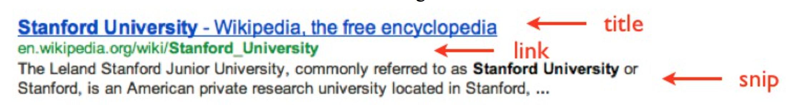

7.1 Question Answering
--

**Can you make a system to compete with IBM's Jeopardy-playing "Watson"?**

Part II: Question Answering with Google

## Overview

If you were looking for the answer to a factoid question, you might very well Google the question and look for the answer in the snippets. In this assignment you'll be attempting to automate that notion by extracting answers from the Google snippets. You will be responding to questions of the form, "**Where is the location of x?**", where x is a famous structure or landmark. In the assignment, we give you 10 values of x as a training set, which you can use to train your answer extractor.

## Data

Data files can be found in the `data` folder, where you will find `landmarks.txt`, `googleResults_tagged.txt`.

`landmarks.txt` contains sample query landmarks and their corresponding city/country answer. An example line is
      `1\tstatue of liberty\tliberty island/new york harbor/new york city, new york`  
      
This is a tab separated file where the **first column** represents the number for the landmark, the **second column** represents the landmark's name, and the **third column** represents the landmark's location. In the third column, the portion that comes before the comma represents the city of the landmark, and the portion after the comma represents the country or the state of the landmark, where a state is given if the landmark is located in the United States. Note that some times multiple cities/possible responses are given where each acceptable response is separated by a slash.  

`googleResults_tagged.txt` file contains the Google query results for Google queries of the form, "Where is the location of x?". The file contains a total of 10 queries for the landmarks listed in the landmarks.txt file and each query contains a list of the top 10 results returned by Google, with the exception of the query results for Saint Basil's Cathedral, which contain only 9 results. The results for each query is separated by an empty line and each result is clustered into a set of three lines. The first line contains the title of the result, the second line contains a snippet of text from the website, and the third line contains the link to the webpage of the result. See the illustration below for an overview of the meaning of each line:

The text from the Google results were also run through the Stanford NER (Named Entity Recognition) tagger, which outputs three possible tags for each item: ORGANIZATION, LOCATION, and PERSON. The tags themselves have not been modified in any way, and thus are not guaranteed to be correct, however, you will likely still find them helpful. Finally, some phrases will also be marked with the em tag, which shows words that Google bolded in their results.

## Implementation Details

In this assignment, you will be modifying the method `guessLocation()`, located in `python/Googling.py`. The `guessLocation()` method takes a list of `GoogleQuery` objects for a specific query, where each GoogleQuery object encapsulates the information provided by a result in Google. Each Google query object contains 3 String fields: the title, snip, and link for that specific results. Using the information from the GoogleQuery objects, you are to return a `Location` object, which contains two fields, a city and country, where the country field represents a state if the landmark is located in the United States. Currently the starter code returns empty strings for both fields, which denotes "No Guess". In this part you will **not** have to return your queries in the form of a Jeopardy response. Note that the code only requires modifying the `guessLocation()` method (and adding any necessary helper methods). You can also optionally edit the `processQueries()` method or add any necessary global/class variables and import statements. Editing the `processQueries()` method, for instance, will allow you to use external information (such as gazatteers), which is only allowed for this part.  

After running the code, the program will output a group of tab separated categories. The first column in each category represents the landmark for the guess, the second column represents the guess your program outputted for the **city** in which the landmark is located, the third column represents the acceptable list of cities where the landmark is located (or in some cases, regions), and fourth column represents the guess your program outputted for the **country** for in which the landmark is located, the fifth column represents the country or state in which the landmark is located. The CORRECT GUESSES section lists landmarks for which you correctly guessed both the city and country/state of the landmark, while the NO GUESSES and INCORRECT GUESSES portion lists landmarks for which either the city or country/state guess was incorrect or was not guessed at all. (It might just be easiest to run the code and look at the output instead of processing all of that).  

## Evaluation

In total, there are 10 landmarks for which 10 cities and 10 countries/states must be guessed in the training data. Correct guesses receive a score of +1, incorrect guesses receive a score of -1, and no guesses receive a score of 0. Thus, your program will output a score between -20 to 20 depending on how many of your guesses were correct.  